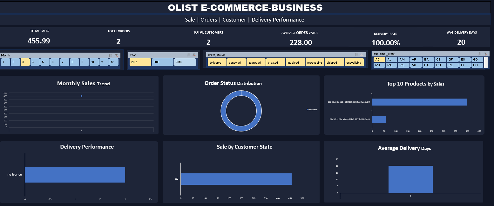

Olist E-commerce Sales Analysis Dashboard

 Project Overview

This project analyzes the Brazilian Olist e-commerce dataset to understand sales performance, customer behavior, order trends, and delivery performance.

I built this interactive Excel dashboard to turn raw e-commerce data into clear and meaningful business insights.

 Tools & Techniques

* Microsoft Excel
* Power Query
* Pivot Tables & Pivot Charts
* Slicers
* Data Cleaning & Transformation
* Excel Formulas
* Dashboard & KPI Analysis

 Key KPIs

* Total Orders
* Total Customers
* Total Sales
* Average Order Value
* Delivery Rate
* Average Delivery Days

 Analysis Covered

* Monthly Sales Trends
* Top Products by Sales
* Customer Analysis
* Sales by Customer State
* Order Performance
* Delivery Performance

 Key Insights

The analysis provides an overview of sales trends, customer distribution, top-performing products, and delivery performance, helping understand the overall business performance of the Olist e-commerce platform.
📂 Dataset

The project uses the **Brazilian E-Commerce Public Dataset by Olist**, originally available on Kaggle.

🎯 Project Objective

The main objective of this project was to practice real-world data analytics using Excel — from data cleaning and transformation to analysis, KPI creation, and interactive dashboard development.

📁 Project Files

* `Olist_Dashboard.png.png` — Dashboard preview
* `Olist_Ecommerces_Sales_Analysis_Github.xlsx.xlsx` — Complete analysis and dashboard

---

**Project Type:** Data Analytics | Excel Dashboard
**Tools:** Microsoft Excel, Power Query, Pivot Tables
